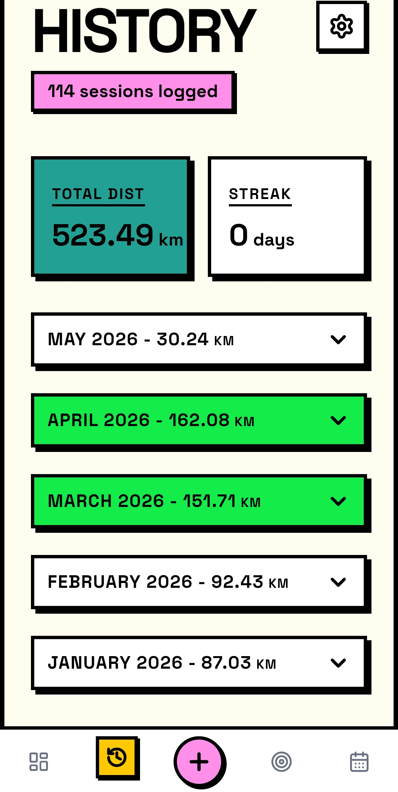
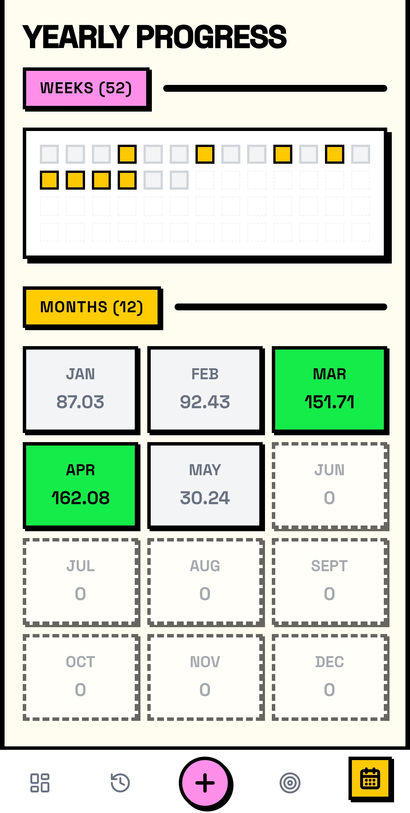

# 🚶‍♂️ StrideTrack

100% vibe code

**Note:** Please note that there are still features that have not yet been installed, but the app works perfectly fine.

A user-friendly Android app (.apk) designed to help you track your walks, set personal goals, and keep track of them. The app is built with a focus on seamless mobile user experience.

> **Note:** StrideTrack now supports **Google Health Connect**! You can automatically sync walking and hiking sessions directly from smartwatches (like Garmin, Samsung Galaxy, and Fitbit) or companion apps without manual entry.

---

## 📸 Screenshots

<div align="center">
  
    &nbsp;&nbsp;&nbsp;&nbsp;
  
</div>
<br />
<div align="center">
  
    &nbsp;&nbsp;&nbsp;&nbsp;
  
</div>

<br />
<div align="center">
  
  &nbsp;&nbsp;&nbsp;&nbsp;
  
</div>
<br />
<div align="center">
  &nbsp;&nbsp;&nbsp;&nbsp;
  
  

</div>

---

## ✨ Features

- **📊 Dashboard:** Get a full overview of your daily, weekly, and monthly progress directly on the front page.
- **🎯 Goals:** Set personal goals for how much you want to walk per week, month, and year, and track how close you are to reaching them.
- **📝 Log Walk:** Easy and quick logging of the distance you've walked on your latest trips.
- **📅 History:** Coming in the next version.
- **⚙️ Settings:** Customize the app to your needs and easily delete your data.
- **📱 Android App (.apk):** Built as a native app via Capacitor, ready to install on your Android phone.

## 🔒 Data & Privacy

StrideTrack is built with a 100% focus on user privacy and data ownership, employing a **Local-First with Opt-In Cloud Sync** philosophy:

- **Local-First by Default:** Everything you enter (how far you walk, times, goals, preferences) is saved **locally on your own phone**. The app works 100% offline and does not require an account to use. No one else has access to your local data.
- **Voluntary Cloud Backup (Opt-In):** We have integrated a secure, voluntary cloud backup system using **Supabase**. If you choose to connect a profile, your walk logs and goals will be automatically backed up in the cloud, protecting your history from physical device loss or app deletion.
- **Database-Level Protection:** When using cloud sync, your data is secured at the lowest database engine level using PostgreSQL **Row-Level Security (RLS)**. Only your authenticated user account has permission to read, write, or modify your walking data.
- **Offline / Local Backups:** If you prefer not to use the cloud, you can still manually export and import your complete walking history as a local backup file at any time via the settings.

## 🛠️ Technologies

The project is built with modern web technologies to ensure the best performance and experience:

- **Frontend Framework:** React 18
- **Programming Language:** TypeScript
- **Styling:** Tailwind CSS (with custom color themes)
- **Build Tool:** Vite
- **Icons:** Lucide React
- **Mobile/Native App:** Capacitor (Built for Android / APK)

## 🚀 Getting Started (Run Locally)

To run the project locally on your own machine:

1. **Clone the project:**
   ```bash
   git clone https://github.com/KS71/WalkGoal.git
   ```
2. **Enter the folder:**
   ```bash
   cd WalkGoal
   ```
3. **Install dependencies:**
   ```bash
   npm install
   ```
4. **Start the app:**
   ```bash
   npm run dev
   ```

## 👨‍💻 Development & History

**v2.3.1:**
- **Danger Zone / Delete All Data:** Added a secure option in Settings to permanently delete all local walks, goals, and settings with dual confirmation prompts.
- **Official Website Link:** Added a direct "Visit Website" link to [stridetrack.fit](https://stridetrack.fit) under the Settings Support section.
- **Streamlined Health Connect Permissions:** Optimized read permissions by removing step and calorie tracking from Health Connect integration to focus purely on high-fidelity distance and workouts, reducing permission overhead.
- **Removed Goal Step Estimates:** Simplified goal setup and walks by tracking pure distance, removing estimated step counts.

**v2.3.0:**
- **Google Health Connect Integration:** Automatically sync walks and hikes directly from smartwatches (Garmin, Samsung, Fitbit) and companion apps.
- **Selective Source Filtering (No Double-Counting):** Prioritizes GPS smartwatch distance over phone background step sensors to prevent double-counting.
- **De-duplication & Local Deletion Memory:** Prevents duplicates with deterministic ID mapping and remembers deleted Health Connect activities so they do not reappear on subsequent syncs.
- **In-App English Setup Guide:** Added a step-by-step setup and troubleshooting guide explaining connections and permission management.
- **Direct System Settings Shortcuts:** Easily adjust, grant, or revoke individual Health Connect permissions directly from the Settings menu.
- **Weekday Formatting:** Formats synced walks with matching generic weekday titles (e.g. "Wednesday") to align with manual logs.

**v2.2.1:**
- **Press-and-Hold Deletion:** Replaced the touch-swipe-to-delete item gesture on History with an elegant, responsive press-and-hold (long press) gesture. This completely avoids touch conflicts with side-swipe page navigation.
- **Improved Spacing Layout:** Decreased vertical empty space on the History tab between the header tip and the stats cards row for a more compact and readable mobile display.

**v2.2.0:**
- **Cloud Sync Integration:** Securely back up all your walking logs, goals, and settings in the cloud using Supabase. Logs are seamlessly synchronized between device local storage and your database.
- **Double Password Verification:** Added confirmation input on registration modal to ensure accurate profile password setup.
- **English Localization:** Translated and standardized all new Settings UI elements, modals, and synchronizing workflows to match the rest of the application.
- **Local Data Backup Clarity:** Refined Settings category and descriptions to clearly distinguish local file backups from cloud sync.

**v2.1.6:**
- **Swipe Navigation:** You can now smoothly swipe left and right to navigate between the different pages in the app.

**v2.1.5:**
- **Yearly Overview:** All months now consistently show the distance walked.
- **History:** Monthly group headers now turn green when the goal for that month is reached.
- **Settings:** Removed Daily Reminders. Updated the Roadmap to include Google Health Connect Integration.

**v2.1.4:**
- **Monthly History Grouping:** Walks in the History tab are now automatically grouped by month with collapsible sections.
- **Monthly Totals:** Each month now displays the total distance walked directly in the header.
- **Auto-Expand:** The most recent month is automatically expanded for quick access.

**v2.1.3:**
- Added the ability to manually select the time of the walk instead of defaulting to 'Now'.
- Implemented a festive "Goal Reached" graphic when progress reaches 100% or more.

**v2.1.1:**
- Added Settings navigation to sub-headers (Log Walk, Goal Setup, History).
- Added Last Backup date display with 12h/24h format support in Settings.
- Added a brand new Yearly Overview Statistics screen.
- Improved header styling across all pages to prevent overlap with the Android status bar.
